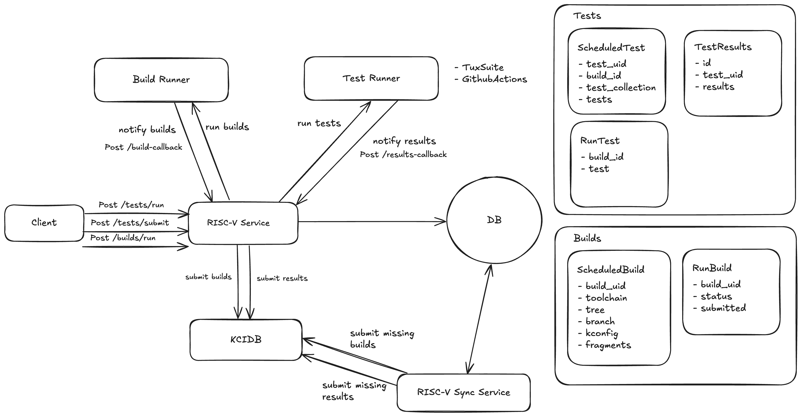

# RISC-V KernelCI bridge

FastAPI app that provides REST services which give any maintainer or kernel developer a simple way of submitting tests to [KernelCI](https://kernelci.org/) without adjusting any existing infrastructure to KernelCI's needs.

The project makes use of [KCIDB](https://github.com/kernelci/kcidb) to submit results, meaning you'll need a token to perform submissions. To obtain a token please follow the instructions described in [KCIDB github repository](https://github.com/kernelci/kcidb).

## Project layout

    docker-compose-dev.yml    # Docker compose file to use in development
    docker-compose.yml        # Docker compose file to use in production
    Makefile                  # Used to run typically used commands
    log.ini                   # Logging configuration file
    caddy/                    
        Caddyfile             # Caddy configuration file
    backend/    
        Dockerfile            # FastAPI app Dockerfile
        app/
            app/              # FastAPI app main directory
                api/          # Main API directory
                    v1/
                        endpoints/          # Contains all endpoint implementations
                            builds.py       # Submit a build endpoint
                            tests.py        # Submit tests endpoint
                            boot.py         # Submit boot tests endpoint
                            ...  
                        api.py              # Gathers all endpoints into a single router
                core/
                    config.py               # Contains main settings class
                    db.py                   # Handles DB specific settings
                    runners.py              # Contains all general runner functions
                middleware/                 # All middlewares go here
                    json_middleware.py      # Specific for wrongly formed json sent by TuxSuite
                models/                     # Database models (use SQLModel/SQLAlchemy)
                    builds.py
                    tests.py
                schemas/                    # Pydantic schemas used when parsing requests bodies
                    builds.py               # Models for the submit build service
                    tests.py                # Models for the submit tests service
                    ...
                services/                   # Contains code that connects to third-party services (runners may be added here)
                    kcidb_services.py       # KCIDB related functions
                    runner_service.py       # General runner functions
                    ...
                utils/                      # Utilitary functions and classes
                    exceptions.py
                    test_parser.py
                main.py                     # Defines the main FastAPI app
            pypoetry.toml
            poetry.lock

## Sytem design

Below there is a diagram portraing the design of the system:



## Available services

The app provides services that allow running kernel tests and builds, and submit tests.
There is a separate sync service which is meant to be called once a day to retry failed submissions.

### Run tests

The endpoint is [`/api/v1/tests/run`](https://github.com/RISC-V-KernelCI-Mentorship/riscv-kcidb-bridge/blob/main/backend/app/app/api/vi/endpoints/tests.py#L25). To run tests you need to send a `POST HTTP` request with a body with this structure:

```python
    {
        "runner": "string",
        "build_id": "string",
        "kernel_image_url": "string",
        "modules_url": "string",
        "tests": [
            "string"
        ],
        "collection": "string"
    }
```

The specific details on each of the fields can be found in the [`TestSuite` schema](https://github.com/RISC-V-KernelCI-Mentorship/riscv-kcidb-bridge/blob/main/backend/app/app/schemas/tests.py#L19).

### Run boot tests

The endpoint is [`/api/v1/boot-test/run`](https://github.com/RISC-V-KernelCI-Mentorship/riscv-kcidb-bridge/blob/main/backend/app/app/api/vi/endpoints/boot.py#L23). To run boot tests you need to send a `POST HTTP` request with a body with this structure:

```python
    {
        "runner": "string",
        "build_id": "string",
        "kernel_image_url": "string",
        "modules_url": "string"
    }
```

The specific details on each of the fields can be found in the [`TestSuite` schema](https://github.com/RISC-V-KernelCI-Mentorship/riscv-kcidb-bridge/blob/main/backend/app/app/schemas/tests.py#L19).

### Run builds

The endpoint is [`/api/v1/builds/run`](https://github.com/RISC-V-KernelCI-Mentorship/riscv-kcidb-bridge/blob/main/backend/app/app/api/vi/endpoints/builds.py#L20). To run builds you need to send a `POST HTTP` request with a body with this structure:

```python
    {
        "runner": "string",
        "toolchain": "string",
        "tree": "string",
        "branch": "string",
        "kconfig": "string",
        "fragments": [
            "string"
        ]
    }
```

The specific details on each of the fields can be found in the [`BuildData` schema](https://github.com/RISC-V-KernelCI-Mentorship/riscv-kcidb-bridge/blob/main/backend/app/app/schemas/builds.py#L7).

### Submit tests

Tests can be run in an outside system but still use this app to submit results to KernelCI. To do so you have to send a `POST HTTP` to [`/api/v1/tests/submit`](https://github.com/RISC-V-KernelCI-Mentorship/riscv-kcidb-bridge/blob/main/backend/app/app/api/vi/endpoints/tests.py#L50) request with a body with this structure:

```python
    {
        "test_uid": "string",
        "build_id": "string",
        "tests": [
            {
            "test_name": "string",
            "test_collection": "string",
            "result": "string",
            "logs": "string"
            }
        ]
    }
```

The specific details on each of the fields can be found in the [`RunnerTestsResults` schema](https://github.com/RISC-V-KernelCI-Mentorship/riscv-kcidb-bridge/blob/main/backend/app/app/schemas/tests.py#L13).

### Synchronize submissions

A `POST HTTP` to [`/api/v1/sync/results`](https://github.com/RISC-V-KernelCI-Mentorship/riscv-kcidb-bridge/blob/main/backend/app/app/api/vi/endpoints/sync.py#L12) synchronizes non-submitted tests results. While [`/api/v1/sync/builds`](https://github.com/RISC-V-KernelCI-Mentorship/riscv-kcidb-bridge/blob/main/backend/app/app/api/vi/endpoints/sync.py#L30) synchronizes non-submitted builds.

Both of these services expect and empty body.

This endpoints correspond to the RISC-V Sync Service seen in the system diagram.
